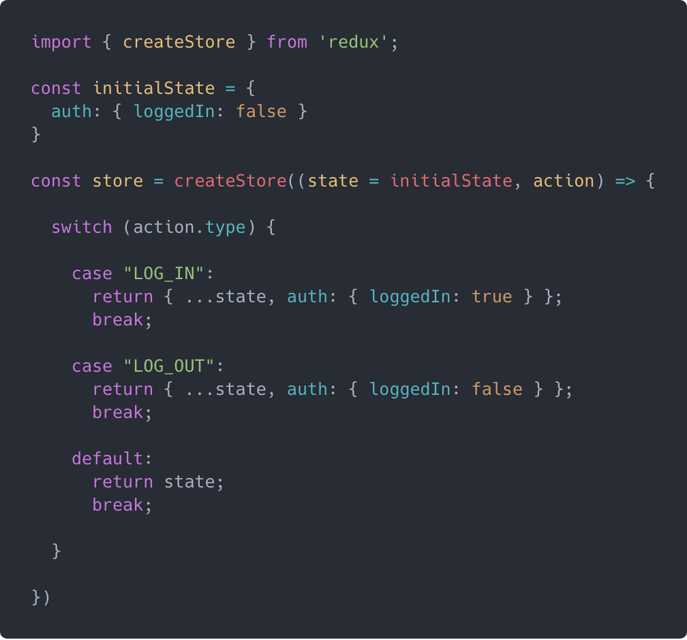

In today's lecture we have been working on connecting the Redux into our React app.

# How to create container components in React that are connected to the Redux state
React provides two major mechanisms for providing data to components, namely props and state. While props are read-only and allow a parent component to pass attributes to a child component, state is local and encapsulated within the component and can change at any time in the component’s lifecycle.

Since state is a very powerful mechanism for building powerful and dynamic React apps, it becomes necessary that state is properly managed in the application. Several libraries already exist that provide a well-structured architecture for managing application state, such as Flux, Redux, and MobX.

Redux is a predictable state container for JavaScript apps ranging from vanilla apps to framework apps. It has a very tiny footprint yet allows us to write consistent apps that can run in any environment:



 here is how you can connect the app to the Redux store:
 ```Javascript
 import React from 'react';
import ReactDOM from 'react-dom';
import { Provider } from 'react-redux';
import createStore from './createReduxStore';

const store = createStore();
const rootElement = document.getElementById('root');

ReactDOM.render((
  <Provider store={store}>
    <AppRootComponent />
  </Provider>
), rootElement);
```
### When to use connect()
1. Creating container components
```javascript
import React from 'react';
import { connect } from 'react-redux';
import Profile from './components/Profile';

function ProfileContainer(props) {
  return (
    props.loggedIn
      ? <Profile profile={props.profile} />
      : <div>Please login to view profile.</div>
  )
}

const mapStateToProps = function(state) {
  return {
    profile: state.user.profile,
    loggedIn: state.auth.loggedIn
  }
}

export default connect(mapStateToProps)(ProfileContainer);
```
2.  Manually create a container component and connect it to the Redux store
```javascript
import React, { Component } from 'react';
import store from './reduxStore';
import Profile from './components/Profile';

class ProfileContainer extends Component {

  state = this.getCurrentStateFromStore()
  
  getCurrentStateFromStore() {
    return {
      profile: store.getState().user.profile,
      loggedIn: store.getState().auth.loggedIn
    }
  }
  
  updateStateFromStore = () => {
    const currentState = this.getCurrentStateFromStore();
    
    if (this.state !== currentState) {
      this.setState(currentState);
    }
  }
  
  componentDidMount() {
    this.unsubscribeStore = store.subscribe(this.updateStateFromStore);
  }
  
  componentWillUnmount() {
    this.unsubscribeStore();
  }
  
  render() {
    const { loggedIn, profile } = this.state;
    
    return (
      loggedIn
        ? <Profile profile={profile} />
        : <div>Please login to view profile.</div>
    )
  }
  
}

export default ProfileContainer;
```