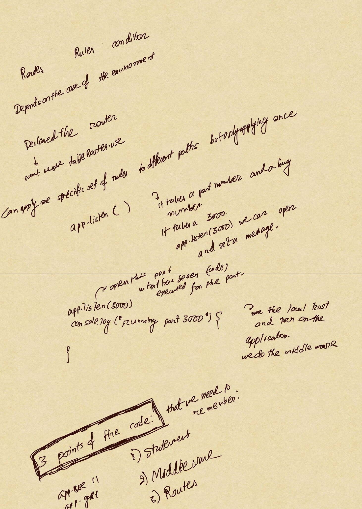

**Today's Lecture is about Express.js Scaffolding.**

# Express.js Scaffolding
To generate a skeleton Express.js app, we need to run a terminal command—express [options] [dir|appname]—the options for which are the following:
* -v, --view <engine>: Add view support (dust|ejs|hbs|hjs|jade|pug|twig|vash) (defaults to pug)
* -c <engine>, --css <engine>: Add stylesheet <engine> support, such as LESS (http://lesscss.org), Stylus(http://learnboost.github.io/stylus) or Compass(http://compass-style.org) (by default, plain CSS is used)
* --git: Add .gitignore
* -f, --force: Force app generation on a nonempty directory

## Express.js Command-Line Interface
There are ways to create an app with Stylus support in Express.js.

*express -c styl express-styl*

Then we can use:

*$ cd express-styl && npm install*
and
*$ DEBUG=my-application ./bin/www*