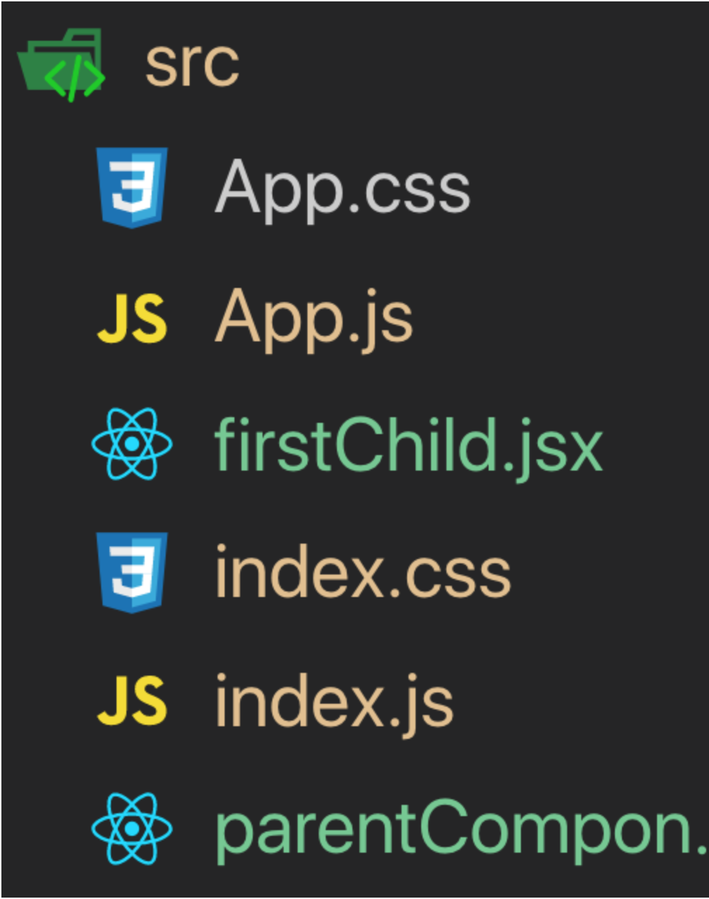

## React Components --> 

**What are Components?**
They are the main builidng block of an React eleement. A component is a javascript class or funciton that optionaly accepts inputs which could be prps and then returns a React element which describes how the section of the UI should appear.

*An Example of First component includes:*

```
const Greeting = () => <h1>Hello World today!</h1>;
```

**Functional Components:**
- These components are purely presentational and are simply represented by a function that optionally takes props and returns a React element to be rendered to the page.
- It is preferred to use functional components whenever possible because of their predictability and conciseness. Since, they are purely presentational, their output is always the same given the same props.
We may consider functional component to serve these conditions which include:
1. Functional:- Becuase they are basically considered to be functions.
2. Stateless:- Because they do not hold or manage any state
3. Presentational:- Becuase usually they provide output to UI elements.

**Class Components:**
These components are ususally created with the help of ES6's class syntax.
They often have additonal features which has the ability to contain logic, local state, and other capabailities.

1. Class:- They are basically called classes.
2. Smart:-They contain the logic.
3. Stateful:- They can hold and/or manage local state
4. Container:-They usually hold or contain a lrage number of components, mostly functional components.


There are various ways to choose different typ[es of components. However under these certain crieria we are going to use a class component:
- If we need to manage the local state
- If we need to add lifecycle methods to our components
- If we need to add logic for event handlers

**Props**
- Props are React’s way of making components easily and dynamically customisable. They provide a way of passing properties/data down from one component to another, typically from a parent to a child component (unidirectional dataflow).
- Props are read-only and that a component must never modify the props passed to it. As such, when a component is passed props as input, it should always return the same result for the same input.

In the idnex.html, we can run this folloowing scripts in our *index.html* document which might look like this:
```
const Greeting = props => <h1>Hello {props.name}</h1>;
   ReactDOM.render(
     <Greeting name={‘Edmond’}/>,
     document.getElementById('root')
   );  
```
**Using Props with Class Components**
We can add props to class components which is quite a similar process to the one we used in the functional component. We can observe two chnages that is associated with it. These include:

1. Props is not passed as an argument to the class
2. The **name** attribute is accessed using the **this.props.name** instead of **props.name**. To explain better we can use this code, as an example:

*The Greeting Component*
```
class Greeting extends React.Component {
     render(){
     return <h1>Hello {this.props.name}</h1>;
     }
   }ReactDOM.render(
     <Greeting name={‘Edmond’}/>,
     document.getElementById('root')
   );
```

**Default Props**
- Default props are often used by a component as default attributes in case no props are explicitly passed to the component.
- Default props are helpful in enabling us an offer to a better user experience through our app, as such *The Greeting* that we used above. Using thet default props we can ensure that the greeting is always rendered even if the name attribute has not been explicitly passed to the component. 


**Composing Components**

- We need to remember that, React allows us to reference components within other components, allowing us to to add a level of abstraction to our application. 
- We can write the component structure like this:
```
UserProfile
    |-> Avatar
    |-> UserName
    |-> Bio
```
**What is a Component?**

- A component is an independent, reusable code block, which divides the UI into smaller pieces.
- We can consider the components as LEGO pieces and here we use LEGO pieces to make LEGO strcuture. Similarly, Components are like LEGO pieces (or LEGO blocks), thus we create a webpage or UI using many different code blocks(components).

**Funictional Components**

- A functional component is basically considered to be a JavaScript function which returns a React element. As such, the function below represents a Valid React Component:

```
function Welcome(props) {
  return <h1>Hello, {props.name}</h1>;
}
```

- We can also define a React functional component as a **JS Function**:

```
function Example() {
return (
<h1>I'm a funcational component!</h1>
)
}
```

- We can also define a React functional component as a **ES6 arrow function**

```
const Example = () => {
return (
<h1>I'm a funcational component!</h1>
)
}
```


**Class Components**

- Class components are ES6 classes.
- They are more complex than functional components including constructors, life-cycle methods, render( ) function and state (data) management.
- In the example below, we can see how a simple class component looks like:
```
import React, {Component} from 'React'

class Example extends Component {
render() {
return (
<div>This is an example component</div>
)
}
}

export default Example
```


**Creating Our First Component**
In order to create and call React components, we are going to maintain these certain stages. These include:
1. I will create 1 class componnet, which is going to be considered as the **Parent Component**
2. I will add 1 **Functional Component** as **Child Component**
3. Then I will call the Child Parent inside the Parent Component.
4. Finally, I will call the *Parent Component* on the **Root File (app.js)**.



## Website to go through:-->
1. https://www.styled-components.com/  ---> Show us the styled-componnets and the styles we can use for our website.
2. https://www.freecodecamp.org/ ---> This is the website where we can learn more about using JS, HTML, and CSS. This is more or less tutorial based work. 


